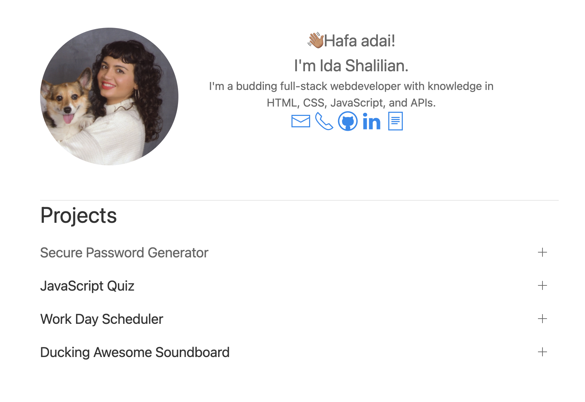
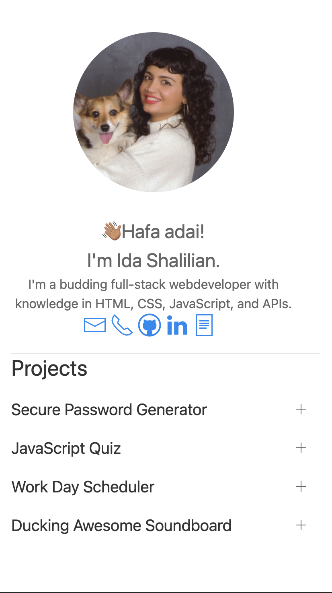

# Portfolio 2.0

This is my updated portfolio. I did not want to override my old homework repo, so I just added the 2 to the repo name. This portfolio was made using [UIkit](https://getuikit.com/), a really easy to use CSS framework, and is mobile friendly. It features some of my favorite projects I've made so far, as well as a link to my LinkedIn and Resume.

## [View the portfolio here.](https://corgimaman.github.io/portfolio2/)

### How it looks on a computer:

### How it looks on mobile:

#### Future Portfolio Designs:
- Add a dark mode
- Change the project layout to a grid, with links to the repos that fade over the images